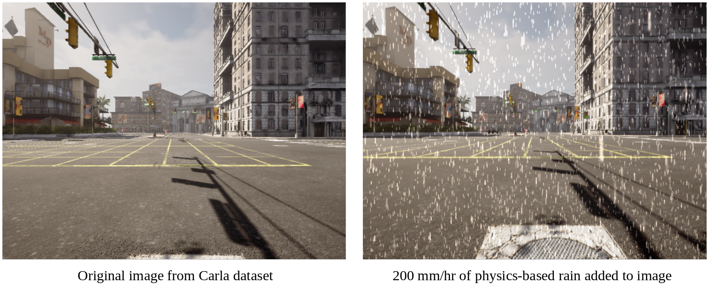

# Rain Rendering for Evaluating and Improving Robustness to Bad Weather

This repository has been forked from [astra-vision/rain-rendering](https://github.com/astra-vision/rain-rendering).  Please visit the original repo for more information about the associated paper, [Rain Rendering for Evaluating and Improving Robustness to Bad Weather](https://link.springer.com/article/10.1007/s11263-020-01366-3), and licensing information.  Please note that not all third party dependencies are open source.

## Summary
This code augments clear weather images with a controllable amount of rain using physics-based rendering.  An example is shown for an image captured from the [Carla simulator](https://carla.org/).  In order to add physics-based rain, you will require depth images as well as the original RGB images.



## Additions
This fork contains the following additions to the original repo:
* Dockerfile to automatically build and install all dependencies in a container
* Added config file for Carla dataset
* Fixed physics simulator hanging issue.

## Setup
Install [Docker](https://www.docker.com/).  Then:
```bash
git clone git@github.com:m-yuhas/rain-rendering.git
cd rain-rendering
git submodule update --init
docker build -t rain-rendering:latest .
```

## Augmenting Images
1. First, organize your dataset as shown below.  Here a dataset named *carla* is organized into folders, each containing a sequence of images.  Each sequence folder contains two subfolders: one for depth images and one for RGB images.  These folders must be named *depth* and *rgb* respectively.  The file names for the corresponding detph and RGB images must be identical.  The depth images should be formated as a monochrome PNG image where the pixel intensity indicates distance in meters.
```bash
carla/
├── clip1
|   ├── depth
|   │   ├── clip1.0.png
|   │   ├── clip1.1.png
|   │   └── clip1.n.png
|   └── rgb
|       ├── clip1.0.png
|       ├── clip1.1.png
|       └── clip1.n.png
└── clip2
   ├── depth
   │   ├── clip2.0.png
   │   ├── clip2.1.png
   │   └── clip2.n.png
   └── rgb
       ├── clip2.0.png
       ├── clip2.1.png
       └── clip2.n.png
```

2. Modules for loading nuScenes, Carla, Cityscapes, and Kitti have already been provided.  However, if you are using a custom dataset, please modify the *config/customdb.py* to include your camera settings and rename your dataset's root folder to *customdb*.  The camera settings are listed below.
Here is a sample configuration file `config/customdb.py`:
```python
# Camera intrinsic parameters
settings["cam_hz"] = 10               # Camera Hz (aka FPS)
settings["cam_CCD_WH"] = [1242, 375]  # Camera CDD Width and Height (pixels)
settings["cam_CCD_pixsize"] = 4.65    # Camera CDD pixel size (micro meters)
settings["cam_WH"] = [1242, 375]      # Camera image Width and Height (pixels)
settings["cam_focal"] = 6             # Focal length (mm)
settings["cam_gain"] = 20             # Camera gain
settings["cam_f_number"] = 6.0        # F-Number
settings["cam_focus_plane"] = 6.0     # Focus plane (meter)
settings["cam_exposure"] = 2          # Camera exposure (ms)

# Camera extrinsic parameters (right-handed coordinate system)
settings["cam_pos"] = [1.5, 1.5, 0.3]     # Camera pos (meter)
settings["cam_lookat"] = [1.5, 1.5, -1.]  # Camera look at vector (meter)
settings["cam_up"] = [0., 1., 0.]         # Camera up vector (meter)

# Sequence-wise settings
settings["sequences"] = {}
settings["sequences"]["seq1"] = {}
settings["sequences"]["seq1"]["sim_mode"] = "normal"
settings["sequences"]["seq1"]["sim_duration"] = 10  # Duration of the rain simulation (sec)
```

3. Start the Docker container and mount the volume containing your input dataset.  The output dataset with physics-based rain will be written to a volume in */var/lib/docker/volumes/* on Linux or *\\\\wsl$\docker-desktop-data\mnt\wsl\docker-desktop-data\data\docker\volume* on Windows.
```bash
docker run -it -v <path to dataset on host>:/opt/rain-rendering/data/source/<dataset name> rain-rendering:latest
```

4. Run the simulation inside the container.
```bash
python main.py --dataset <dataset name> -i <rain intensity in mm/hr>
```